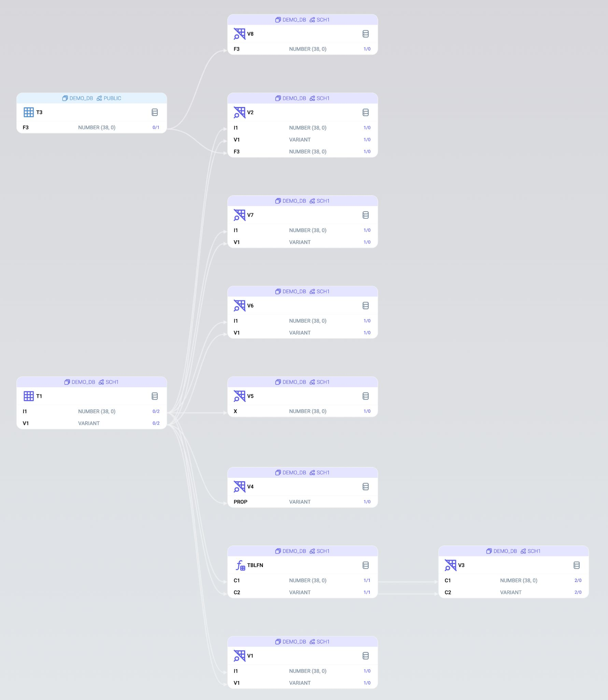

# Test Your Data Lineage Tool
**[Dwh.dev](https://dwh.dev)** team has been dealing with SQL static analysis for a long time, and we know very well that all databases behave differently: unique SQL syntax, object types, and relationships, peculiar behavior of seemingly obvious things. 

Documentation often describes not all the nuances of a database's behavior, or yet sometimes it simply doesn't match the actual state of affairs.

That's why we decided to create a collection of specific use cases for different databases that we've encountered.

You can execute these statements from any of the attached SQL files and check how your selected DATA LINEAGE TOOL handles such syntax. (Spoiler: not very well). 

Additionally, we've attached the results of **[Dwh.dev](https://dwh.dev)**'s work so that you can make the right choice :)

Let's start with **Snowflake** because at the moment, we know this database the best. 
In this repository, we intentionally won't cover cases with special **Snowflake** objects (PIPE, STREAM, TASK, POLICY, etc.) because the vast majority of existing DATA LINEAGE TOOLS know nothing about them and won't provide you any information (but not **[Dwh.dev](https://dwh.dev)**). 

The focus will be on the peculiar behavior of regular objects and the relationships encapsulated within them. 

Some of the **Snowflake** syntax exists for compatibility with other databases.

We'll also tell you about the functionality of **[Dwh.dev](https://dwh.dev)**, which, in our opinion, should exist in all DATA LINEAGE TOOLS, but unfortunately doesn't exist yet...

The repository will be updated, stay tuned!

## Snowflake SQL Syntax and Behavior
- [Identifiers](#identifiers)
- [Default and Virtaul Columns](#default-and-virtaul-columns)

## Dwh.dev Features
- [Navigation](#navigation)
- [Join and Where](#join-and-where)


# Snowflake SQL Syntax and Behavior
## Identifiers

### Basic Syntax
**Snowflake** provides an extensive toolkit for working with object and column identifiers. Let's start with the basics: identifiers with and without quotes ([documentation](https://docs.snowflake.com/en/sql-reference/identifiers-syntax))

Even at this stage, we won't achieve full compatibility with the syntax of other databases. However, two nuances deserve special attention:
- Identifiers without quotes are converted to uppercase.
- Identifiers within backticks behave similarly.

```sql
CREATE TABLE `Myidentifier` (
  f5 INT
);

CREATE TABLE "quote""andunquote""" (
  f6 INT
);
```

We collected all the varieties of the basic syntax [in 1.identifiers.1.sql](./snowflake/1.identifiers/sql/1.identifiers.1.sql)

Here is the **[Dwh.dev](https://dwh.dev)** result:

[](./snowflake/1.identifiers/media/1.identifiers.1.jpg)


### Special syntax
In addition to the basic syntax, **Snowflake** has special functionality:

- [Literals and Variables as Identifiers](https://docs.snowflake.com/en/sql-reference/identifier-literal).
A special **IDENTIFIER()** function to get a reference to an object or column from a session variable or string.

- [Table Literals](https://docs.snowflake.com/en/sql-reference/literals-table)
Special function **TABLE()** to get a reference to an object from a session variable or string.

- [Double-Dot Notation](https://docs.snowflake.com/en/sql-reference/name-resolution#resolution-when-schema-omitted-double-dot-notation)
A special syntax that allows the **PUBLIC** scheme to be omitted when addressing an object.


```sql

CREATE VIEW V1 AS
  SELECT * 
  FROM
    identifier($table_var1)
;

-- Column Identifier
CREATE VIEW V4 AS
  SELECT identifier('DEMO_DB.SCH1.T1.V1'):json_prop as prop 
  FROM 
    DEMO_DB.SCH1.T1
;

-- Double-Dot Notation
CREATE VIEW V8 AS
  SELECT * 
  FROM
    DEMO_DB..T3
;
```

This syntax is often found in the description of transformations, because it helps to use the same source code with different object names.

We have collected all kinds of special syntax [in 1.identifiers.2.sql](./snowflake/1.identifiers/sql/1.identifiers.2.sql).

Here is the **[Dwh.dev](https://dwh.dev)** result:


[](./snowflake/1.identifiers/media/1.identifiers.2.jpg)


## Default and Virtaul Columns
**Default and Virtual Columns** also contain information about data lineage. And as usual, nobody pays attention to it :)

```sql
-- default value
CREATE TABLE t1 (
  id1 int,
  id2 int default (id1 +1)
);

CREATE VIEW v1 AS
  SELECT *
  FROM t1
;
```

If during data transformations, only the id1 column is inserted into the **T1** table, the lineage information will be lost.

At **[Dwh.dev](https://dwh.dev)**, we display it like this:

[](./dwh/media/default-virtual.1.png)

With **Virtual columns**, an even more precarious situation arises. It's impossible to insert data into a virtual column, and they will ALWAYS depend on other columns in the table.
```sql
-- virtual column
CREATE TABLE T2 (
  A INT,
  B INT,
  C INT,
  D INT AS (CASE WHEN A>0 THEN B ELSE C END)
);

CREATE VIEW v2 AS
  SELECT *
  FROM t2
;
```
At **[Dwh.dev](https://dwh.dev)**, we display it like this:
[](./dwh/media/default-virtual.2.png)


# Dwh.dev Features
## Navigation

The commonly accepted navigation standard for Lineage is "expanding" each subsequent level on demand. This involves requesting information about each subsequent level from the backend.

At **[Dwh.dev](https://dwh.dev)**, we took a different approach - dependency information is loaded to the client, allowing us to display the necessary number of levels instantly, rebuilding the graph as needed.

Small graphs (with up to 500 connections) can be displayed entirely. Large graphs are available for exploration only in parts. Initially, through a search, you find the necessary object in the catalog and by clicking the "lineage" button, you enter the "group" of that object.

[](./dwh/media/navigation.1.png)

The main object of the group is highlighted with a dashed border.

The lineage screen supports scaling, scrolling, various types of centering, and a mini-map. You can always return to the main object by clicking the first button in the button group, aligning it in the toolbar, or by the object name in the top right.

To the left of the central object are **Upstream** objects; to the right, **Downstream** objects. **Upstream** objects may have violet circles on the right side of the object. The numbers in these circles indicate the number of objects in **Downstream** that do not belong to the current group. Similarly, there is a green circle on the left of **Downstream** objects, indicating the number of objects from **Upstream** outside of this group.

To enter a group of any of the objects on the screen, double-click on it. To go back, press ESC.

By default, 2 levels of lineage are displayed. You can change this value in the settings panel under Stream Options:

[](./dwh/media/navigation.2.png)

You can also quickly disable the display of all Upstream/Downstream levels in the toolbar with the **"Toggle stream length to 0"** buttons.

If you want to explore the graph in a "classic" mode, navigating through its levels by "expanding" them, there is a **"Custom Path"** mode for this purpose:

[](./dwh/media/custom-path.1.png)

The labels on the edges of the graph show how many levels are hidden in this branch, the number of objects in the first level, and the total number of objects.

You can highlight only the objects that interest you at the moment:

[](./dwh/media/custom-path.2.png)

When working with complex graphs, even in **"Custom Path"** mode, it can be challenging to orient oneself. Therefore, you can "straighten" the selected path using the **"Straighten the path"** button in the toolbar:

[](./dwh/media/custom-path.3.png)

Both of these modes also work at the column level:

[](./dwh/media/c2c.1.png)

[](./dwh/media/c2c.2.png)


## Join and Where

Typically, data lineage tools provide information about the immediate movement of data within the database:

```sql
CREATE VIEW v1
AS 
  SELECT c1
  FROM t1
```
Data from the column **t1.c1** flows into **v1.c1**:

[](./dwh/media/jw.1.png)

However, this data might be insufficient when it comes to refactoring. For instance, when certain columns aren't involved in the data movement but are only involved in **JOIN** or **WHERE** clauses:

```sql
CREATE VIEW v2
AS 
  SELECT c1
  FROM t1
    JOIN t2 ON t1.id = t2.parent_id
  WHERE 
    t1.c2 > t2.f2
```

Usually, data lineage tools won't provide information about columns **t1.id, t1.c2, t2.parent_id, t2.f2**, but at **[Dwh.dev](https://dwh.dev)**, we've made them visible!

[](./dwh/media/jw.2.png)

